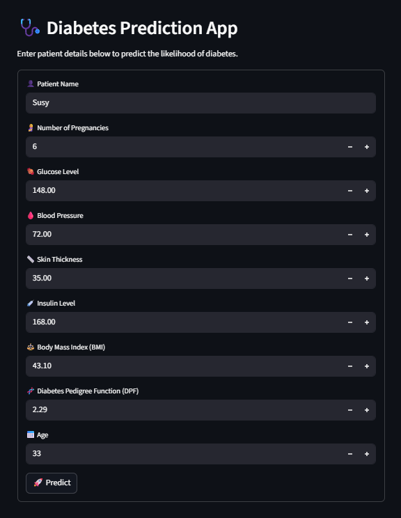

# 🛡️ Diabetes Prediction: Robust & Fine-Tuned System


## 📌 Overview
This repository hosts a **High-Fidelity Machine Learning Pipeline** for predicting diabetes, designed to overcome the limitations of standard academic implementations.

Unlike basic replication studies that often suffer from data leakage, this project prioritizes **Generalization Capability** and **Robustness** by implementing:
1.  **Champion Model:** Transitioned from Random Forest to **XGBoost** for superior predictive performance.
2.  **Zero Data Leakage:** Strict separation of training and testing data *before* any preprocessing (Scaling/SMOTE).
3.  **Recall Optimization:** Hyperparameter tuning specifically targeted to maximize **Sensitivity (Recall)**, ensuring the model effectively detects positive diabetic cases (minimizing False Negatives).

*(Note: For a comparison study where I replicated a paper's flawed methodology for academic purposes, see my [Research Replication Repo](https://github.com/viochris/Diabetes-prediction-project).)*

## ✨ Key Features

### 🚀 Advanced Model Selection (XGBoost)
Based on extensive benchmarking, **XGBoost (Extreme Gradient Boosting)** was selected as the champion model. It consistently outperformed Random Forest and SVM in handling tabular data patterns, particularly in optimizing the **Recall** metric which is critical for medical screening.

### 🛡️ Leakage-Free Pipeline
To ensure the model works on real-world unseen data:
* **Split First:** Data is divided into Training and Testing sets immediately.
* **Fit on Train, Transform on Test:** The Scaler learns parameters ONLY from `X_train`.
* **Safe Oversampling:** SMOTE is applied strictly to the training fold, keeping the test set pure.

### 📂 Modular Deployment Architecture
The project is structured for scalability, separating the research notebook from the deployment logic:

```text
├── app/                                             # 💻 APPLICATION SOURCE CODE
│   ├── app.py                                       # Main Streamlit application
│   ├── model.py                                     # Backend logic & inference
│   └── preprocess.py                                # Utils for input formatting
├── assets/                                          # 🖼️ STATIC ASSETS
│   └── diabetes_app_ui.png                          # App Screenshot
├── models/                                          # 📦 ARTIFACTS (Serialized Objects)
│   ├── scaler.joblib                                # Saved MinMaxScaler
│   └── model_hp_tune.joblib                         # Saved Fine-Tuned XGBoost Model
├── notebooks/                                       # 🔬 RESEARCH & EXPERIMENTATION
│   └── ml-prediction-diabetic-fine-tune-code.ipynb  # Fine-Tuning & XGBoost Implementation
└── requirements.txt                                 # Dependency list
````

## 🛠️ Tech Stack

  * **Frontend:** Streamlit
  * **Model Engine:** XGBoost Classifier
  * **Data Processing:** Pandas, NumPy, Joblib
  * **Imbalanced Data:** Imbalanced-learn (SMOTE)
  * **Environment:** Python 3.x

## 📊 Performance Results

By utilizing **GridSearchCV** with `scoring='recall'`, the fine-tuned XGBoost model achieved:

  * **Optimization Goal**: Maximizing Sensitivity (Recall).
  * **Outcome**: The tuned XGBoost model is optimized to effectively detect positive diabetes cases, prioritizing the reduction of False Negatives.
  * **Validation**: Verified via Stratified K-Fold Cross Validation to ensure consistency across different data subsets and maintain class balance.

## 🚀 Installation & Usage

1.  **Clone the Repository**

    ```bash
    git clone [https://github.com/viochris/Diabetes-prediction-fine-tuned-project.git](https://github.com/viochris/Diabetes-prediction-fine-tuned-project.git)
    cd Diabetes-prediction-fine-tuned-project
    ```

2.  **Install Dependencies**

    ```bash
    pip install streamlit xgboost scikit-learn pandas numpy joblib imbalanced-learn
    ```

3.  **Run the Dashboard**
    Execute the app from the root directory:

    ```bash
    streamlit run app/app.py
    ```

4.  **Access the App**
    Open your browser and navigate to `http://localhost:8501`.

## 📷 Screenshots
### Web Application Interface
User-friendly interface built with Streamlit allowing for real-time patient data input and instant prediction:



-----

**Author:** [Silvio Christian, Joe](https://www.linkedin.com/in/silvio-christian-joe)
*"Real-world data requires real-world validation strategies."*
